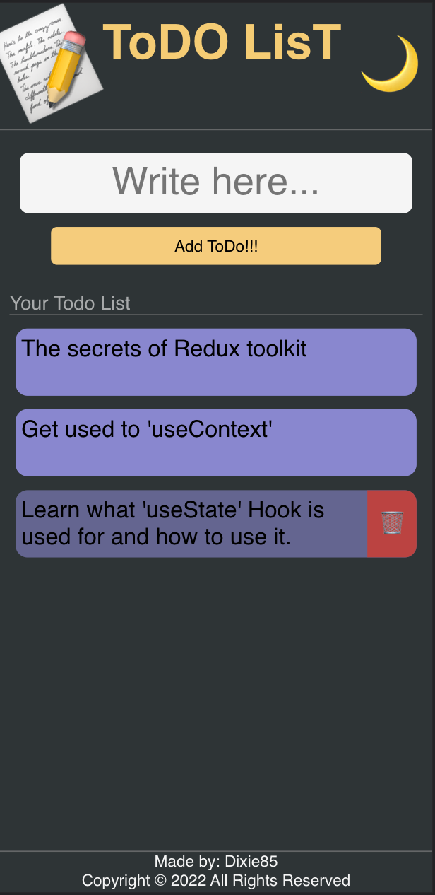

 

   # The State-Management Repository

 

   For the purpose of demonstrating state management, I'll use my good old ToDo app project.

    As the title states, in this repository you can find several ways of managing the STATE in a React project using different tools and technologies.

 For easier understanding of the state management, my recommendation for reviewing the code is in the following order:

&nbsp;  [ToDo_useState](https://github.com/Dixie85/State-Management)

&nbsp;  [ToDo_useContext](https://github.com/Dixie85/State-Management)

&nbsp;  [ToDo_Redux-Toolkit](https://github.com/Dixie85/State-Management)

 

## Here's a sneak peek of the good old ToDo App 

